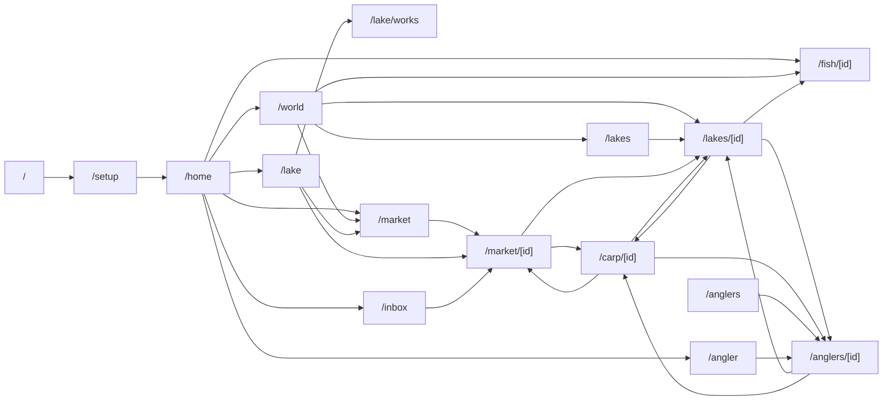
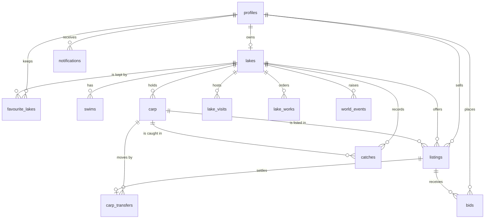

# Carp Mania — Design II: the world, the lake builder and the fish market

Derived top-down, the same way as DESIGN.md: stories → views → site map → data → backend, then the rules. DESIGN.md still holds for everything it covers; this document changes it only where it says so. Every name below is meant to become a file, a table, a command or a function of that name, written to CLAUDE.md.

## What changes, in one paragraph

Every player starts with **£100,000** instead of £5,000. Instead of being handed a ten-acre starter lake they **find a water somewhere on the globe** — an old gravel pit, a disused quarry, a flooded clay pit, a mature estate lake, a farm pond, or a green field they dig themselves — and then **shape it**: islands, gravel bars, deep holes, dredging, margin shelves, reed beds, lily pads, snags, swims, a car park, a lodge, an aerator. Every lake sits at a real latitude and longitude on a **spinning globe** anyone can browse, fly around and fish from. And because fish are now worth serious money, lakes **buy and sell fish from each other** in a world fish market with auctions, transport, quarantine, a fish farm that always sells and a dealer who always buys. The heart of the game — one lake, one owner; feed it, stock it, fish it — does not change. It gets a world around it.

## Decisions already taken

- **The world is the whole globe**, with real geography. Regions carry climate, land prices, growth ceilings, local strains and a local angling culture.
- **One lake per player, endlessly reshapeable.** No estates or complexes in this scope; `lakes_one_per_owner` stays.
- **Money stays in pounds sterling everywhere, weights in lb and oz.** It is the brand's voice and it keeps every number in the game comparable across the world.
- **Existing players are grandfathered.** Their lake keeps its exact shape (the classic outline becomes a stored layout), they are given the £95,000 difference between the old float and the new on top of whatever they hold, and on their next visit they pin their water on the globe.

## Contents

1. User stories
2. Views
3. Site map
4. Data
5. Backend (CQRS)
6. The rules — regions and seasons, sites, groundworks, terrain and fishing, valuation and fame, the market, transport and quarantine, the fish farm and the dealer, the simulated day
7. Spending the £100,000 — four worked openings
8. Migration and grandfathering
9. Build order and sizing
10. Prerequisites, risks, deliberate simplifications, and what is not in this scope

---

## 1. User stories

Every player is still both a **fishery owner** and an **angler**. The stories below are additions; where a DESIGN.md story changes, it is named at the end of the section.

### The money

- As a new player, I want to start with £100,000, so that finding a water, shaping it and stocking it are real decisions with trade-offs rather than a free starter kit.
- As an existing player, I want the difference between the old float and the new added to my balance and my lake kept exactly as it is, so the update lands as a gift, not a reset.

### Finding a water (setup)

- As a new player, I want to spin the globe and choose where in the world my fishery is, so my lake has a climate, a local angling culture, land at a local price, and neighbours.
- I want to choose between kinds of site — old gravel pit, disused quarry, flooded clay pit, estate lake, farm pond, or dig my own — each with its own price, character, problems and what already lives in it, so my first choice shapes the whole game.
- I want to choose the size of the plot, so I can trade acreage against money left to spend.
- I want to name my water, survey what I have bought, and see how much of my £100,000 is left at every step.
- I want to do my first groundworks and my first stocking inside the same flow, or skip them and come back later.
- I want to open the gates — set a day ticket and go public — when I am ready and not before.

### Shaping the lake (groundworks)

- As an owner, I want to see my water as a plan I can edit — shoreline, islands, depths, lake-bed, features, swims — so I understand and can change what I run.
- I want to build islands (small, medium, large), so I get island margins to fish to and shelter for the fish.
- I want to make gravel bars and plateaux, deepen holes and channels, dredge silt, and cut margin shelves into a quarry's steep sides, so the lake-bed suits the fishing I want.
- I want to plant reed beds and lily pads and sink snags, so fish have places to hold and anglers have features to cast to.
- I want to build, move, rename and remove swims, so the bank is fishable where the features are.
- I want to reshape the shoreline, extend the water and buy adjacent land, so my lake can grow.
- I want facilities — a car park and track, a lodge, an aerator — so more anglers come, pay more, and the fish survive a heatwave.
- I want works to cost money up front, take fishery days, and disturb the water while they run, so groundworks are a plan and not a click.
- I want to see works in progress, cancel one I regret, and read a ledger of everything I have built.

### Fishing a shaped lake

- As an angler, I want to cast to a spot — an island margin, a gravel bar, a snag, the deep hole — and have the spot decide bed, depth and feature, not just the swim I am sat in.
- I want islands to block casts, so choosing a bank matters.
- I want fish to hold on features, and in deep water in winter, so watercraft is real.
- I want seasons — spring, summer, autumn, winter, flipped in the southern hemisphere — to change growth, bites and how many anglers turn up.

### The world

- As an angler, I want to spin a globe of every fishery in the game, zoom into a region, and see each lake as a pin, so I can find waters by where they are.
- I want to filter and sort — reputation, biggest fish, day ticket, region, acres, fish for sale, anglers on the bank right now — so I can find the water I am after.
- I want to hover a pin for the essentials and click it for a postcard: a live top-down picture of that lake with its fish swimming, its numbers, and the buttons to look around, fish it, favourite it, or see its fish for sale.
- I want a live feed — big catches, sales flying as arcs between lakes, records, new waters opening — so the world feels alive.
- I want world and regional leaderboards — biggest fish, best water, best angler — so there is something to chase.
- I want to favourite lakes and see them first.
- I want a public page for every angler, so I can see who caught my fish and where they fish.
- As an owner, I want my lake on the globe with its postcard and its region, so anglers find it.

### The fish market

- As an owner, I want to list a fish for sale — fixed price, or an auction with a reserve — so prize fish turn into money.
- I want every fish to have a dossier — portrait, name, strain, weight now and best ever, age, condition, fame, where it came from, every catch and every sale — so buyers know what they are buying and sellers can show it off.
- I want to browse fish for sale across the whole world, filtered by weight, strain, price, region and time left, so I can buy the fish my water needs.
- I want to bid, be told when I am outbid, and buy now when a price is right.
- I want to see the landed cost — price, transport, quarantine — before I commit.
- I want transport to take time, distance to cost, and a fish that crosses a border to sit in quarantine, so buying from across the world is a decision.
- I want a fish farm that always sells small and medium fish, and a dealer who will always buy a fish at a fair discount, so I am never stuck.
- I want fame — a fish's catches, records and captors — to be part of its value, so the fish I grow, and the anglers who catch it, make it worth more.
- I want an inbox for outbids, sales, purchases, arrivals, finished works and records set on my water.

### DESIGN.md stories that change

- "As a new player, I want a starter fishery" becomes the setup flow. `CreateStarterFishery` is retired; the classic starter lake survives only as the grandfathered layout.
- "I want to stock more carp, bigger being dearer" becomes buying from the fish farm (small and medium fish, limited weekly supply, local delivery) and from other lakes (the market). `StockCarp` is retired.
- "I want to browse public lakes" gains the globe; the list stays as the fast, searchable fallback.
- "I want to walk the bank and choose a swim" gains the cast: the spot you cast to now decides bed, depth and feature.

---

## 2. Views

Industry-standard patterns only: a wizard with a persistent budget bar, a canvas editor with a tool rail and a properties panel, a map with a filter rail and a detail drawer, a marketplace grid with facets, a listing page with a bid box, an inbox. Nothing invented for its own sake.

| View | Serves | New or changed |
|---|---|---|
| **Setup wizard** `/setup` | Finding a water: region and pin → site and plot → name → survey and first works → first stock → open the gates. Budget bar throughout. | New |
| **My Lake** `/lake` | Everything an owner does. The canvas becomes the **plan**; tabs gain **Groundworks**, **Market** (my listings, my bids, sales), **Works ledger**. Stock tab gains the fish farm and the dealer. | Changed |
| **Groundworks editor** `/lake/works` | The plan, full width, with a tool rail (island, bar, deepen, dredge, shelf, reeds, lilies, snag, swim, shoreline, extend, land, facility) and a properties panel showing cost, days and effect before you order. | New |
| **The Globe** `/world` | Spin, zoom, filter, hover, click. Filter rail on the left, live feed along the bottom, leaderboards tab, postcard drawer on the right. | New |
| **Lake postcard drawer** (inside `/world`) | One lake at a glance: live mini-scene, numbers, fish for sale, who is on the bank, buttons. | New |
| **Lakes list** `/lakes` | Search, sort, paginate. The fallback for phones and for "just show me a list". | Changed |
| **Lake page** `/lakes/[id]` | Read-only postcard canvas of the real layout, stock, catch reports, fish for sale from this lake, records, "Fish here". | Changed |
| **Fishing session** `/fish/[id]` | Same flow; the water click is now a cast to a spot and the spot's terrain shows in the rod card. Fish show on features. Season and time of day in the clock. | Changed |
| **The Market** `/market` | Facets (weight band, strain, price, region, lake, time left, auction/buy-now, sort). Cards. Market index (average £/lb per band, last 7 fishery days). Sales history. | New |
| **Listing** `/market/[listingId]` | The dossier plus the bid box: current bid, next bid, buy-now, time left, landed cost for *my* lake (transport, quarantine, arrival). | New |
| **Fish dossier** `/carp/[id]` | The fish's public page: portrait, name, strain, lake, owner, weight now and best ever, age, condition, fame, origin, growth chart, catches, sales. "Make an offer" is out of scope; "See listing" when listed. | New |
| **Anglers** `/anglers`, `/anglers/[id]` | Directory by skill; public profile with PBs, recent catches, their water. `/angler` (mine) stays. | New |
| **Inbox** `/inbox` | Notifications, newest first, mark read. Badge in the navigation bar. | New |
| **Home hub** `/home` | Adds: market watch (my open listings and bids), works in progress, world feed (last five events), inbox count. | Changed |

### 2.1 The setup wizard

```
┌───────────────────────────────────────────────────────────────────────────────┐
│ CARP MANIA          FIND YOUR WATER            Budget £100,000  ▓▓▓▓▓▓▓▓▓▓ £100,000 left │
├───────────────────────────────────────────────────────────────────────────────┤
│ ① Where  ② Site  ③ Name  ④ Survey  ⑤ Stock  ⑥ Open the gates                  │
├──────────────────────────────┬────────────────────────────────────────────────┤
│                              │  OLD GRAVEL PIT                    £39,000     │
│        (globe, pin dropped   │  Clear water over gravel bars and two islands  │
│         in Kent, region      │  left by the workings. Four to eight old fish  │
│         "UK & Ireland",      │  nobody has catalogued. Silt low, weed medium. │
│         land £2,500 / acre)  │  ● 10 acres  ○ 5  ○ 15  ○ 20                    │
│                              │  Starts with: 2 islands, 3 bars, 7 swims,      │
│                              │  reputation 10, unknown originals 18–34 lb     │
│                              │  ┌──────────┐ ┌──────────┐ ┌──────────┐        │
│                              │  │ Quarry   │ │ Clay pit │ │ Estate   │  …     │
│                              │  │ £33,000  │ │ £36,000  │ │ £47,000  │        │
│                              │  └──────────┘ └──────────┘ └──────────┘        │
├──────────────────────────────┴────────────────────────────────────────────────┤
│  ← Back                                              Buy this site → £39,000  │
└───────────────────────────────────────────────────────────────────────────────┘
```

- Step ①: the globe (the same component as `/world`, in "choose a plot" mode). Click a region to see its guide — climate, land price, growth ceiling, local strains, how many anglers fish there. Drop a pin anywhere on land inside the region.
- Step ②: site cards. Price is base works plus land at the region's price for the chosen plot. Each card says what it starts with and what its problem is.
- Step ③: name. Default `"<display name>'s Water"` as today.
- Step ④: the plan appears with the site's template layout. The editor is the real editor (§2.2) with a "suggested first works" list on the right (a quarry suggests margin shelves; a pit suggests swims on the bars). Skippable.
- Step ⑤: the fish farm order form (§2.4 Stock tab). Skippable.
- Step ⑥: set the day ticket, choose public, and open. Until the gates open the lake is private and no NPC anglers come.

Money leaves the account at each purchase, not at the end; the budget bar is the running balance. Leaving the wizard and coming back resumes at the first incomplete step (`GetSetupProgress`).

### 2.2 The plan and the groundworks editor

```
┌─ TOOLS ─┐ ┌────────────────────────────────────────────────┐ ┌─ ISLAND (MEDIUM) ────────┐
│ ▸ Select│ │                                                │ │ Cost            £6,000   │
│   Island│ │     ~~~~~~~~~~~~~ water ~~~~~~~~~~~~~~~~        │ │ Takes           10 days  │
│   Bar   │ │   ~~~   ┌ - - ┐ (draft island, dashed)  ~~~     │ │ Water lost      0.4 acre │
│   Deepen│ │  ~~   ▓▓│     │▓▓   [12 ft hole]         ~~     │ │ Silt while built  +8     │
│   Dredge│ │  ~~  ▓▓▓└ - - ┘▓▓▓         ▒▒ gravel bar  ~~    │ │ New margin       470 ft  │
│   Shelf │ │   ~~~   ▓▓▓▓▓    ●Snag Bay              ~~~     │ │                          │
│   Reeds │ │     ~~~~~~~~~~~~~~~~~~~~ ●The Point ~~~~         │ │ Rotate ⟲ ⟳  Size S M L   │
│   Lilies│ │ |||| reeds        ●Dam Wall                     │ │                          │
│   Snag  │ │                                                 │ │ [ Order works  £6,000 ]  │
│   Swim  │ └────────────────────────────────────────────────┘ │ [ Cancel ]               │
│   Shore │  Layers: ☑ depth ☑ bed ☑ features ☑ swims ☐ fish   └──────────────────────────┘
│   Extend│  Water 9.6 acres · Plot 10 acres · 2 works in progress
│   Land  │
│ Facility│
└─────────┘
```

- The plan is `LakeCanvas` with a builder overlay. Depth zones shade the water darker; bed patches tint it (gravel pale and speckled, clay warm, silt dark, rock grey); features draw as they do today (reeds, weed) plus lilies, snags (a fallen tree) and bars (pale streaks).
- Each tool places a draft: islands and bars are templates you drag, rotate and size; deepen, dredge, extend and bed patches are painted polygons; shelves and reeds are bank stretches; snags and swims are points; the shoreline tool drags outline vertices; the land tool buys adjacent plot area; the facility tool places the car park, the lodge or the aerator.
- The properties panel prices the draft live from `GroundworksCatalogue` and shows its effects and constraint failures ("island must sit in water", "swim must sit on the bank", "too many islands for the acreage") before **Order works** is enabled.
- Ordered works show dashed and labelled "in progress — 6 days"; the Works ledger tab lists them with cancel (50% refund within the first fishery day).

### 2.3 The Globe

```
┌─ FIND A WATER ────────┐┌──────────────────────────────────────────┐┌─ POSTCARD ───────────────┐
│ Search lake or owner  ││                                          ││  ┌────────────────────┐  │
│ Region      [All   ▾] ││          .  ·  wireframe globe  ·  .     ││  │ live mini-scene    │  │
│ Reputation  ≥ [40]    ││       ·    ╭──── volt graticule ────╮    ││  │ fish swimming      │  │
│ Biggest     ≥ [30 lb] ││     ·     │  ▲ ▲     ▲   Europe  ▲  │    ││  └────────────────────┘  │
│ Day ticket  ≤ [£40]   ││    ·      │ ▲▲▲▲(12) ▲▲    ▲        │    ││  Bluebell Pit  ·  Kent   │
│ ☐ Fish for sale       ││    ·      │   ▲      ▲ ▲       ▲    │    ││  Reputation 62  10 acres │
│ ☐ Anglers on the bank ││     ·     │      ▲        ▲         │    ││  Biggest 41 lb 8 oz      │
│ ☐ My favourites       ││       ·    ╰──────────────────────╯     ││  Day ticket £35          │
│ Sort  [Reputation  ▾] ││          ·  .  drag to spin  .  ·        ││  3 fish for sale         │
│                       ││                                          ││  2 anglers on the bank   │
│ FLY TO                ││ ┌ LIVE ──────────────────────────────┐   ││                          │
│ ▸ My water            ││ │ ✦ 44 lb 2 oz mirror, Lac du Der   │   ││ [ Look around ] [ Fish ] │
│ ▸ Biggest fish alive  ││ │ ⇢ "The Big Common" sold £9,400 → │   ││ [ ★ Favourite ] [Market] │
│ ▸ Somewhere new       ││ │ ✚ New water opened in Ontario     │   ││                          │
│ LEADERBOARDS ▸        ││ └────────────────────────────────────┘   │└──────────────────────────┘
└───────────────────────┘└──────────────────────────────────────────┘
```

- On brand: the globe *is* the wireframe-mesh motif — volt graticule at 35% on carbon-950, land filled carbon-800 with a volt-700 coastline, a surge glow at the limb. Pins are the swim-peg glyph, coloured mist → volt by reputation and sized by heaviest fish; at low zoom nearby pins collapse into a cluster with a count.
- Drag spins with inertia; scroll or pinch zooms; double-click flies to a pin. Hover shows a small card; click opens the postcard drawer and pans the pin into view.
- The live feed subscribes to `world_events`. A sale draws an arc from seller to buyer that fades over ten seconds; a big catch pulses the pin; a record rings it.
- Leaderboards (a tab in the left rail): world and per region — biggest fish alive, biggest ever caught, top reputation, best anglers by overall skill.
- Phone: the rail collapses into a sheet; the list at `/lakes` is one tap away.

### 2.4 My Lake — Stock tab (fish farm and dealer)

The Stock tab keeps the stock table and gains two panels. **The fish farm** sells by weight band — this fishery week's remaining supply for your region, price per fish, delivery £250 per order, arrives next fishery day. **The dealer** shows, per fish in your stock, the instant offer (55% of guide) and a *Sell* button; and a *List on the market* button that opens the listing form (§2.6). Fish in transit or quarantine show as such with the day they arrive.

### 2.5 The Market

```
┌─ THE FISH MARKET ─────────────────────────────────────────────────────────────┐
│ Weight [20–30 ▾] Strain [Any ▾] Price [≤ £5,000 ▾] Region [Europe ▾] [Auction|Buy now|All]  Sort [Ending soon ▾] │
│ Market index (7 days): 20s £118/lb · 30s £290/lb · 40s £640/lb · 50s £1,300/lb │
├───────────────┬───────────────┬───────────────┬───────────────┬───────────────┤
│ [portrait]    │ [portrait]    │ [portrait]    │ [portrait]    │ [portrait]    │
│ Scar 31 lb 4  │ Half Lin 28.. │ The Ghost 36  │ Nudger 22 lb  │ Pearly 41 lb  │
│ mirror · UK   │ linear · FR   │ ghost · HU    │ common · US   │ mirror · FR   │
│ Bid £3,150    │ Buy £2,900    │ Bid £7,800    │ Bid £1,050    │ Bid £11,200   │
│ 6 bids · 2h   │ 41 min        │ 12 bids · 1d  │ no bids · 3h  │ 19 bids · 9h  │
└───────────────┴───────────────┴───────────────┴───────────────┴───────────────┘
```

### 2.6 The listing page and the dossier

The listing page is the dossier with a bid box on the right.

```
┌─ THE GHOST · 36 lb 2 oz ghost carp ────────────────────┐ ┌─ AUCTION · ends in 1d 4h ──────┐
│ [large portrait on the mat, wireframe frame]           │ │ Current bid       £7,800       │
│ Lake: Tisza Pit (Hungary) · Owner: Márk                │ │ Next bid          £7,960       │
│ Best ever 37 lb 0 oz · Age 14 · Condition 84 · Fame 61 │ │ Buy now           £12,000      │
│ Origin: fish farm, 2 years at Tisza Pit                │ │ Reserve           met          │
│ Growth ───────────────────╱‾‾ (weight over time)       │ │ ── Landed at your water ──     │
│ Catches (23)  Sales (1)  Records: lake record          │ │ Transport 1,610 km  £814       │
│  · 36 lb 2 oz · Sam · Snag Bay · chod · fishmeal · 2d  │ │ Commission (seller pays)  —    │
│  · 35 lb 12 oz · NPC Dave P · The Point · ronnie · 5d  │ │ Arrives in 3 days, then        │
│  · …                                                   │ │ 5 days' quarantine             │
│                                                        │ │ [ Bid £7,960 ]  [ Buy now ]    │
└────────────────────────────────────────────────────────┘ └────────────────────────────────┘
```

The seller's listing form (from the Stock tab) asks: auction or buy now; starting price (defaults to the guide price); reserve (optional); buy-now (optional); duration 12 / 24 / 48 / 72 real hours. It shows the listing fee and the commission before confirming.

### 2.7 Changes to the fishing session

- The rod card shows the spot's terrain after a cast: "Island margin · gravel · 5 ft" — the same words the tackle rules use.
- The bank view shows fish holding on features (a ripple, a back breaking the surface) once watercraft is 50 or better.
- The session clock shows the season; winter sessions say so, and the deep hole is where the bites are.

---

## 3. Site map

```
/                landing (sign in)
/setup           find your water — resumes at the first incomplete step; redirects to /home once the gates are open
/home            hub → /lake, /world, /market, /inbox, /angler, /fish/[my lake]
/lake            my fishery: plan + tabs Stock · Feed · Predators · Water · Groundworks · Market · Ledger · Works
/lake/works      the groundworks editor, full width → back to /lake
/world           the globe → postcard drawer → /lakes/[id], /fish/[id], /market?lake=[id]
/lakes           list and search → /lakes/[id]
/lakes/[id]      a lake: postcard canvas, stock, reports, fish for sale, records → /fish/[id], /carp/[id], /anglers/[ownerId]
/fish/[id]       fishing session (cast to a spot)
/market          browse listings → /market/[listingId]
/market/[id]     listing: dossier + bid box → /carp/[id], /lakes/[lakeId]
/carp/[id]       fish dossier → /lakes/[lakeId], /anglers/[id] (captors), /market/[listingId] when listed
/anglers         directory → /anglers/[id]
/anglers/[id]    public angler page → /lakes/[theirLakeId], /carp/[id]
/angler          my profile (unchanged) + link to /anglers/[me]
/inbox           notifications → wherever each one points
/auth/callback, /auth/signout
```



Entry points checked against the stories: every story above reaches its view through this map. The one deliberate double entry is the globe: `/world` for the world, and the same component inside `/setup` step ① for choosing a plot.

---

## 4. Data (what the views demand)

Single source of truth; derive what is derivable. Column names are the ones the migrations will use.

### 4.1 Changed tables

**profiles** — `money` default becomes `100000`; add `home_region text` (the region chosen at setup; the fish farm sells you *your* region's supply) and `plot_latitude`, `plot_longitude` (the pin chosen in step ① of setup, held here until `BuySite` creates the lake, so the wizard can resume). A check constraint `money >= 0` — with bids and escrow, a negative balance must be impossible, not merely unlikely.

**lakes** — add:

| Column | Type | Meaning |
|---|---|---|
| `region` | text | One of `RegionCatalogue` (§6.1). |
| `latitude`, `longitude` | numeric(8,5) | The pin. Null until the owner pins it (grandfathered lakes). |
| `site_type` | text | `gravel_pit`, `quarry`, `clay_pit`, `estate_lake`, `farm_pond`, `greenfield`, `classic` (grandfathered). |
| `plot_acres` | numeric(6,2) | Land owned. `acres` (existing) becomes the *water* acreage. |
| `layout` | jsonb | The plan — §4.3. |
| `fertility` | numeric(5,2) | Natural food 0–100. Set by the site, drifts (greenfield ramps up; dredging knocks it back). |
| `disturbance` | numeric(5,2) | Silt stirred up by works in progress; settles 2 a day. Adds to `silt` for colour, transparency and bites. |
| `is_setup_complete` | boolean | Gates opened. Replaces the "does a lake exist" check in `/home`. |

`acres` stays as a column on purpose: it is the shoelace area of the layout (water minus islands), rewritten whenever the outline or the islands change — which only `applyCompletedWorks` and `BuySite` do; `BuyAdjacentLand` grows `plot_acres`, not the water — so the globe and the list can filter and sort on it without parsing JSON. It is the one cached derived value in the schema, and it is named as such where it is written.

**swims** — `bed_type`, `depth_feet` and `feature` are dropped. They are now derived from the layout at the swim's position and at the cast spot (`terrainAt`, §6.4). The grandfathering migration writes each classic swim's bed, depth and feature into the layout as a patch, zone and feature around its peg first, so nothing changes for existing lakes.

**carp** — add:

| Column | Type | Meaning |
|---|---|---|
| `origin` | text | `farm`, `wild`, `bred`, `classic`. |
| `origin_lake_id` | uuid | Where it first lived. Null for farm fish. |
| `fame` | integer | §6.6. |
| `is_catalogued` | boolean | False for a site's unknown originals until first caught. Uncatalogued fish do not appear in the stock, cannot be listed and do not count on the globe. |
| `transit_until` | timestamptz | Null unless being moved. Not fishable, not fed, not listed while set. |
| `quarantine_until` | timestamptz | Null unless in quarantine. Fed and simulated but not fishable and not listable. |

Best-ever weight, lake record, region record and world record are derived from `catches`.

### 4.2 New tables

**lake_works** — a groundworks order.

| Column | Type | Meaning |
|---|---|---|
| `id`, `lake_id` | | |
| `kind` | text | One of `GroundworksCatalogue` (§6.3). |
| `parameters` | jsonb | The draft geometry: polygon, point, bank stretch, template and transform — whatever the tool produced. |
| `cost` | numeric(10,2) | Charged at order. |
| `ordered_at` | timestamptz | |
| `starts_on` | timestamptz | The lake's `simulated_until` when ordered. |
| `completes_on` | timestamptz | `starts_on` + days × one real hour. |
| `status` | text | `in_progress`, `complete`, `cancelled`. |

**listings** — a fish for sale.

| Column | Type | Meaning |
|---|---|---|
| `id`, `carp_id`, `lake_id`, `seller_id` | | Seller lake and owner at listing time. |
| `kind` | text | `auction`, `buy_now`. |
| `starting_price`, `reserve_price`, `buy_now_price` | numeric(10,2) | Reserve and buy-now optional. |
| `listing_fee` | numeric(10,2) | Charged at listing, never refunded. |
| `ends_at` | timestamptz | Auctions: the chosen duration, extended by anti-sniping. Buy-now: fourteen days, after which it lapses to `unsold`. |
| `status` | text | `open`, `sold`, `unsold`, `cancelled`. |
| `sold_price`, `buyer_id`, `settled_at` | | Set on settlement. |
| `created_at` | | |

Partial unique index: one `open` listing per `carp_id`.

**bids**

| Column | Type | Meaning |
|---|---|---|
| `id`, `listing_id`, `bidder_id` | | |
| `amount` | numeric(10,2) | Debited from the bidder on placement. |
| `transport_cost` | numeric(10,2) | The transport to the bidder's lake, also held from the bidder on placement, so a winner can always pay the landed cost. |
| `status` | text | `leading`, `outbid` (both sums refunded), `won`, `refunded` (listing cancelled or unsold). |
| `placed_at` | | |

**carp_transfers** — every change of lake a fish has ever made, and the money that moved with it.

| Column | Type | Meaning |
|---|---|---|
| `id`, `carp_id` | | |
| `kind` | text | `sale`, `dealer_purchase` (you sold to the dealer), `farm_delivery`, `dealer_sale` (reserved for a future NPC seller). |
| `listing_id` | uuid | Null for farm and dealer. |
| `from_lake_id`, `to_lake_id` | uuid | Null for the farm and the dealer. |
| `price`, `commission`, `transport_cost` | numeric(10,2) | |
| `distance_km` | numeric(8,1) | Great-circle between pins. |
| `departed_at`, `arrives_at`, `quarantine_until` | timestamptz | |

**notifications**

| Column | Type | Meaning |
|---|---|---|
| `id`, `profile_id` | | |
| `kind` | text | `outbid`, `won`, `sold`, `unsold`, `arrived`, `quarantine_over`, `works_complete`, `record_set`, `big_catch_on_your_water`. |
| `title`, `body`, `link` | text | Rendered as written; `link` is a site-map path. |
| `created_at`, `read_at` | | |

**world_events** — the globe's live feed; Supabase Realtime publishes inserts.

| Column | Type | Meaning |
|---|---|---|
| `id`, `kind` | | `big_catch`, `sale`, `record`, `new_water`, `island_built`. |
| `lake_id`, `other_lake_id` | uuid | Buyer for sales. |
| `payload` | jsonb | What the ticker prints: weight, name, price, angler. |
| `created_at` | | Rows older than 7 days are purged by an hourly cron job. |

**favourite_lakes** — `profile_id`, `lake_id`, `created_at`; primary key on both.

### 4.3 The layout

`lakes.layout` is the plan. Coordinates are fractions of the scene, exactly as `swims.position_x/y` are today, so the renderer and the input code keep their maths.

```jsonc
{
  "version": 1,
  "baseDepthFeet": 9,                 // depth anywhere no zone says otherwise
  "baseBed": "gravel",                // gravel | clay | silt | rock
  "outline": [{ "x": 0.12, "y": 0.30 }, …],          // the water's edge, smoothed as today
  "islands": [{ "id": "…", "name": "Long Island", "points": [ … ] }],
  "depthZones": [{ "id": "…", "points": [ … ], "depthFeet": 14 }],
  "bedPatches": [{ "id": "…", "points": [ … ], "bed": "gravel" }],
  "features": [
    { "id": "…", "kind": "gravel_bar",  "points": [ … ] },
    { "id": "…", "kind": "weed_bed",    "points": [ … ] },
    { "id": "…", "kind": "lily_pads",   "points": [ … ] },
    { "id": "…", "kind": "reed_line",   "points": [ … ] },   // an open bank stretch
    { "id": "…", "kind": "snag",        "point": { "x": 0.3, "y": 0.8 }, "name": "The Fallen Oak" }
  ],
  "facilities": ["car_park", "lodge", "aerator"]
}
```

Scale: the scene is a 3:2 rectangle covering the plot, so `feetAcross = sqrt(plot_acres × 43,560 × 1.5)` — 808 ft across for ten acres; the plot size lives in the `plot_acres` column, not in the JSON. Everything measured in feet (margin distances, shelf lengths, casting distances) converts through that one number in `layoutScale.ts`.

Islands do not carry their own margin polygons; "island margin" is a distance test. Bars are features *and* bed patches — `applyCompletedWorks` writes both when a bar finishes, so the renderer draws a pale streak and the tackle rules see gravel.

### 4.4 Region, site and works catalogues

Regions, sites, groundworks, facilities, the valuation curve and the transport rules are **static domain code**, not tables: they change with the game's design, not with play. They live in `src/lib/domain/world`, `src/lib/domain/sites`, `src/lib/domain/groundworks` and `src/lib/domain/market`, and the domain test runs them.

### 4.5 Derived, never stored

Water acreage (cached — see above), swim terrain, a fish's best-ever weight, lake/region/world records, "anglers on the bank now" (real-player `lake_visits` in the last ten minutes), fish-farm supply remaining this week (weekly quota minus `farm_delivery` transfers in the region this week), the market index (average £/lb of `sale` transfers per band over the last seven fishery days), the season (from the world clock), a fish's favourite feature (from its id), landed cost (distance between pins), listing time left, whether a lake is "open now" (`is_public and is_setup_complete`).

### 4.6 Entity diagram



---

## 5. Backend (CQRS)

Same shape as today: every story is a command or a query in `src/lib/server/commands|queries/<Name>.ts`, gated first (auth → ownership → validation → money), delegating to a pure domain module. Routes stay thin.

### 5.1 The one architectural change: trusted writes

Today the browser's session (anon key + user JWT) is the only database client, and row-level security lets an owner *update anything on their own carp and lake rows*. That was fine while a carp's weight only mattered to its owner. Once a fish can be sold, a player who can `PATCH /rest/v1/carp?id=eq.…` with `{"weight_lb": 60}` can mint £50,000. So:

- **Reads stay under RLS** as now.
- **Player intents that only touch the player's own rows in ways that cannot create value** stay as app-code writes: renaming a lake, setting the day ticket, going public or private, favouriting, saving rods, marking notifications read.
- **Every write that changes value — weight, condition, fame, ownership of a fish, money, a listing's state — happens in one of two trusted places:**
  1. a `security definer` Postgres function, when two players' rows change together (a bid, a sale, a day ticket — the pattern `pay_day_ticket` and `record_catch` already use); or
  2. the server's **service-role client** (`SUPABASE_SERVICE_ROLE_KEY`, server-only, never shipped to the browser), used by `SimulateElapsedTime` and the groundworks and market commands after their gates have run.
- The RLS policies "owners manage carp" and "owners update their lake" are narrowed: `carp` becomes read-only to players; `lakes` gets column-level `update` on `name, day_ticket_fee, is_public` only — the pin and the region are written once, by trusted commands, and never move. `profiles` update is limited to `display_name, saved_rods`; `home_region`, the plot, `money` and the skills move only through functions and the service role (otherwise a player could re-home themselves into a region whose farm still has fish this week).

`createServerSupabase.ts` gains a sibling `createTrustedSupabase.ts`; commands that need it ask for it by name, so a reader can see at a glance which commands write with authority.

### 5.2 Commands

| Command | Gates | Writes with | Domain module |
|---|---|---|---|
| `ChoosePlot` (region, latitude, longitude) | user; no lake yet; point is on land in that region | trusted — writes `home_region`, `plot_latitude`, `plot_longitude` on the profile until `BuySite` copies them onto the lake | `world/regions.ts`, `world/plotRules.ts` |
| `BuySite` (site, plot acres) | user; no lake yet; money ≥ price | trusted | `sites/siteCatalogue.ts`, `sites/<site>Layout.ts`, `sites/startingStock.ts` |
| `RenameLake` (exists) | | session | |
| `OrderGroundworks` (kind, parameters) | owner; draft valid against layout and constraints; ≤ 3 earthworks in progress (swims and facilities don't count); money ≥ cost | trusted | `groundworks/catalogue.ts`, `groundworks/validateDraft.ts`, `groundworks/priceDraft.ts` |
| `CancelGroundworks` (work) | owner; work in progress; within first fishery day | trusted | `groundworks/refund.ts` |
| `AddSwim`, `MoveSwim`, `RemoveSwim`, `RenameSwim` | owner; on the bank; under the swim cap | trusted (Add is a 1-day work costing £350; the others are instant) | `layout/swimRules.ts` |
| `BuyAdjacentLand` (acres) | owner; money ≥ acres × region land price; plot ≤ 40 acres | trusted | `world/regions.ts` |
| `OpenTheGates` (day ticket) | owner; setup steps 1–3 done | trusted — sets `is_setup_complete` and raises the `new_water` world event | |
| `BuyCarpFromFishFarm` (order: count per band) | owner; supply left this week in home region for every band ordered; money ≥ price + one delivery; biomass stays under 500 lb an acre | **SQL `buy_from_fish_farm`** | `market/fishFarm.ts`, `market/valuation.ts`, `market/density.ts` |
| `SellCarpToDealer` (carp) | owner; catalogued; not listed, in transit or quarantine; condition ≥ 30; fewer than 3 dealer sales from this lake today | **SQL `sell_to_dealer`** | `market/dealer.ts` |
| `ListCarpForSale` (carp, kind, prices, duration) | owner; catalogued; condition ≥ 40; not listed/transit/quarantine; ≤ 20 open listings; money ≥ listing fee | trusted | `market/listingRules.ts` |
| `CancelListing` (listing) | seller; open; no bids (auctions) | trusted → refunds nothing; fee is sunk | |
| `PlaceBid` (listing, amount) | user; not the seller; open; amount ≥ next bid; money ≥ amount + transport to my lake | **SQL `place_bid`** | `market/bidRules.ts` mirrors the SQL for the UI |
| `BuyListedCarpNow` (listing) | user; not the seller; buy-now set; money ≥ price + transport to my lake | **SQL `buy_now`** | |
| `PinLakeOnGlobe` (latitude, longitude) | owner; lake unpinned (grandfathered lakes only — a pin is placed once); on land in the lake's region | trusted | `world/plotRules.ts` |
| `FavouriteLake` / `UnfavouriteLake` | user | session | |
| `MarkNotificationsRead` | user | session | |
| `SimulateElapsedTime` (exists, grows) | owner | trusted | `simulation/simulateOneDay.ts` — now also completes works, settles disturbance, applies season and fertility, ages fish on the world new year, lets quarantines lapse, accrues fame, raises world events |
| `StartFishingSession` (lake) | user; open lake; day ticket | **SQL `pay_day_ticket`** (exists) + stores a per-visit seed | `fishing/sessionSeed.ts` |
| `RecordCatch` (exists, hardened) | visit; the claimed fish and hour match the server's roll from the visit seed | **SQL `record_catch`** | `fishing/biteRoll.ts` |

Retired: `CreateStarterFishery`, `StockCarp`. Closing ended listings is not a command anyone issues: it is the SQL function `close_ended_listings()` on a schedule (§5.4).

### 5.3 Queries

| Query | Returns | Notes |
|---|---|---|
| `GetSetupProgress` | which wizard step is next, money left | drives `/setup` |
| `GetRegionGuide` (region) | catalogue entry plus live counts: lakes, biggest fish, average day ticket | step ① side panel |
| `GetMyFishery` (exists) | + layout, works in progress, fish in transit/quarantine, fertility, season | |
| `GetGroundworksQuote` (kind, parameters) | cost, days, effects, constraint failures | the editor calls it on every draft change; pure domain, no database |
| `GetWorldPins` | `{ id, name, ownerName, region, latitude, longitude, reputation, heaviestLb, acres, dayTicketFee, listingCount, anglersOnBankNow }` for every open, pinned lake | one round trip; a `world_pins` view; the same for every viewer, so it can be cached 60 s at the edge |
| `GetMyFavourites` | the viewer's favourite lake ids | joined onto the pins on the client; never in the shared view |
| `GetLakePostcard` (lake) | layout, swims, catalogued carp (id, strain, weight only), the numbers, fish for sale count, who is on the bank | the drawer; the same canvas as `/lakes/[id]` |
| `GetWorldActivity` | last 50 `world_events` | initial fill before Realtime takes over |
| `GetLeaderboards` (region or world) | biggest alive, biggest ever, top reputation, best anglers | indexes on `carp(weight_lb desc)`, `catches(weight_lb desc)`, `lakes(reputation desc)` |
| `GetPublicLakes` (exists) | + search, sort, page | |
| `GetLake` (exists) | + records, fish for sale, owner link | |
| `GetMarketListings` (filters, page) | cards | filters: weight band, strain, price, region, kind, time left, lake (`/market?lake=` from a postcard); facets map to indexed columns; weight and strain come from a join on `carp` |
| `GetMarketIndex` | average £/lb per band, last 7 fishery days | from `carp_transfers` |
| `GetListing` (listing) | dossier + bid state + landed cost for the viewer's lake | |
| `GetCarpDossier` (carp) | everything on `/carp/[id]` | growth chart is `catches` weights over time plus now |
| `GetMyMarketActivity` | my open listings, my leading and outbid bids, my sales and purchases | Market tab and Home hub |
| `GetFishFarmStock` (region) | supply left per band this week, prices | |
| `GetMyGroundworks` | works in progress and the ledger | |
| `GetAnglerDirectory`, `GetAnglerPublicProfile` (angler) | | |
| `GetInbox` | notifications, unread count | |

### 5.4 SQL functions (security definer, `search_path = public`)

`place_bid(listing, amount)`: lock the listing row; check open, not seller, amount ≥ next bid, bidder money ≥ amount + the transport to the bidder's lake; refund the previous leading bid (amount and its transport); hold both sums; insert bid `leading`; if within the last two minutes, extend `ends_at` by two minutes (cap thirty). `buy_now(listing)`: lock; check; hold price + transport; refund any leading bid; settle. `close_ended_listings()`: for each open listing past `ends_at`: an auction with a leading bid at or above the reserve settles; anything else → `unsold`, holds refunded. `settle(listing, buyer, price)` (private): commission and the held transport to the sink, the net to the seller, `carp.lake_id` → buyer's lake with `transit_until` and `quarantine_until` and the transport stress taken off its condition (§6.8), a `carp_transfers` row, notifications to both, a `world_events` `sale` row. `sell_to_dealer(carp)` and `buy_from_fish_farm(region, order)` are functions too, so that the money and the fish move in one transaction.

pg_cron (available on Supabase) runs `select close_ended_listings()` every minute and purges `world_events` older than seven days once an hour. If pg_cron is ever unavailable, a Vercel cron route (`/cron/close-listings`) calling the same function is the fallback; the function is the contract.

### 5.5 Server-authoritative fishing (prerequisite for the market)

DESIGN.md said it plainly: the session is client-side and `RecordCatch` trusts the client. With a market, an invented catch is invented fame and invented value. The fix keeps the session feeling exactly the same:

- `StartFishingSession` stores a random `seed` on the `lake_visits` row.
- The bite roll becomes deterministic: `biteRoll(seed, rodIndex, hour, castTerrain, rodSetup, skill)` returns whether a fish takes, which fish, and at what minute. The client runs the same pure function to animate; the server runs it in `record_catch` to verify that the claimed fish, rod and hour were really rolled.
- The fight is still played on the client; a lost fish is simply not recorded. The server accepts a catch only for a rolled bite, once per bite.

This is a domain change — a new pure `fishing/biteRoll.ts` that the client's `game/session/biteRoller.ts` and `record_catch` both use, seeded instead of `Math.random` — and one SQL change; no new tables.

### 5.6 Realtime

One channel, `world`, on `postgres_changes` inserts to `world_events`, read by `/world` and the Home hub's feed. Nothing else needs Realtime: bids are polled every ten seconds on the listing page (SvelteKit `invalidate`), which is enough for a game with minute-scale auctions and keeps the listing page trivial.

---

## 6. The rules (the domain)

Every number here is a named constant in a domain module and is exercised by `npm run test:domain`. They are starting values for tuning, not scripture — but they are chosen so the four worked openings in §7 add up and so the market has a reason to exist.

### 6.1 Regions and seasons — `src/lib/domain/world`

The globe is divided into regions. A region gives a lake its land price, its climate, the heaviest a carp can grow there, how many NPC anglers live nearby, what they will pay, and which strains are common. Region is chosen at setup and cannot change (a lake does not move).

| Code | Region | Land £/acre | Growth summer / winter | Ceiling | NPC anglers | Pay | Strains lean to |
|---|---|---|---|---|---|---|---|
| `uk_ireland` | UK & Ireland | 2,500 | 1.00 / 0.35 | 68 lb | ×1.2 | ×1.0 | mirror, common (as today) |
| `france` | France | 1,600 | 1.20 / 0.50 | 100 lb | ×0.8 | ×1.3 | mirror 0.45, linear 0.15 |
| `benelux_germany` | Benelux & Germany | 2,200 | 1.05 / 0.35 | 80 lb | ×1.0 | ×1.1 | as today |
| `iberia` | Spain & Portugal | 1,100 | 1.35 / 0.80 | 90 lb | ×0.7 | ×1.1 | common 0.5 |
| `italy_balkans` | Italy & the Balkans | 1,300 | 1.30 / 0.70 | 95 lb | ×0.7 | ×1.0 | common 0.45 |
| `central_europe` | Hungary, Austria, Czechia, Poland | 800 | 1.40 / 0.40 | 105 lb | ×0.9 | ×0.9 | mirror 0.5 |
| `danube` | Romania & the Danube | 600 | 1.40 / 0.45 | 105 lb | ×0.6 | ×0.8 | mirror 0.45 |
| `north_america` | USA & Canada | 1,400 | 1.15 / 0.40 | 60 lb | ×0.5 | ×0.8 | common 0.7 |
| `south_africa` | South Africa | 700 | 1.30 / 0.80 | 60 lb | ×0.5 | ×0.8 | common 0.55 |
| `australia_nz` | Australia & New Zealand | 900 | 1.25 / 0.75 | 55 lb | ×0.5 | ×0.8 | common 0.6 |
| `japan_east_asia` | Japan & East Asia | 3,200 | 1.10 / 0.50 | 70 lb | ×0.9 | ×1.2 | ghost 0.2 |

- **Growth factor** multiplies daily weight gain; averaged over a year the UK sits at about ×0.68, France ×0.85, the Danube basin ×0.93 and Iberia ×1.08. **Ceiling** replaces `CarpWeight.HeaviestPossibleLb` (62) with `regionGrowthCeiling(region)`: a fish stops growing at its region's ceiling; the ceiling never shrinks a fish (hunger does — §6.10), and a fish moved to a region with a lower ceiling simply stops. The biggest fish in the world will be grown in the Danube basin and bought by everyone else, which is roughly true of the real world too.
- **NPC anglers** multiplies `anglersPerDayFor(reputation)`; **Pay** multiplies `willingnessToPayFor(reputation)`.
- **Strains** replace `StrainCatalogue`'s single rarity table with per-region weights; the listed lean is applied over the default and renormalised. One strain is added: `fully_scaled` (rarity 0.04 everywhere, value ×1.25).

**The world clock.** A fishery day is still one real hour. The fishery day number is `floor(unixMilliseconds / RealMillisecondsPerFisheryDay)`, shared by every lake; the day of the fishery year is that modulo 365, so a fishery year is about fifteen real days and the whole world has winter at the same time — the southern hemisphere shifted by 182 days, decided by the sign of the lake's latitude.

`seasonFraction(dayOfYear, hemisphere)` runs 0 at midwinter to 1 at midsummer on a cosine. From it: growth `= winter + (summer − winter) × fraction`; bites `× (0.5 + 0.5 × fraction)`; NPC anglers `× (0.6 + 0.4 × fraction)`; the four seasons are named for the clock and the ticker by quarter.

### 6.2 Sites — `src/lib/domain/sites`

A site is a template: a starting layout, starting water, a fertility, a silt floor, starting stock and reputation, a price, and a problem. Price = base + region land price × plot acres. Plots come in 5, 10, 15 and 20 acres (the farm pond is fixed at 4). Every template has its swims already named.

| Site | Base | Water | Bed, depth, shape | Fertility (silt floor) | Starts with | The problem |
|---|---|---|---|---|---|---|
| **Old gravel pit** `gravel_pit` | £14,000 | silt 10, weed 25 | gravel; 9 ft; two islands, three bars, one 16 ft hole; 7 swims | 45 (0) | reputation 10; **4–8 uncatalogued originals, 18–34 lb** — nobody knows they are there until they are caught | sparse: it needs stocking; clear water shows every line |
| **Disused quarry** `quarry` | £8,000 | silt 0, weed 5 | rock; 30 ft; sheer sides, no shelves, no islands; 4 swims | 12 (0) | reputation 5; nothing | unfishable until margin shelves and bars are cut; fish grow slowly until fed hard |
| **Flooded clay pit** `clay_pit` | £11,000 | silt 45, weed 20 | clay; 8 ft; one island; 6 swims | 70 (30) | reputation 15; 20 uncatalogued wild commons 8–16 lb | coloured for ever (the silt floor); a bailiff can only take it so far |
| **Estate lake** `estate_lake` | £22,000 | silt 55, weed 45 | silt; 6 ft; one island, reed lines, lily pads, the old dam; 8 swims | 80 (10) | reputation 45; **60 catalogued fish 12–28 lb, two named 30s**, ninety days of catch history | needs dredging and a bailiff; weed chokes it in summer; shallow, so heatwaves bite |
| **Farm pond** `farm_pond` | £3,000 (4 acres fixed) | silt 40, weed 35 | silt; 4 ft; 4 swims | 65 (15) | reputation 10; 150 catalogued stockies 3–6 lb | small: a swim cap of 7 and 400 lb an acre fills up fast; a long road to a big fish |
| **Greenfield** `greenfield` | £3,500 per acre of water dug + £2,000 for the inlet | silt 5, weed 0 | clay; 8 ft; you draw the outline (at least 2 acres of water) | starts 10, climbs to 60 over 90 days (0) | reputation 0; nothing | sterile for its first season; the dearest water per acre |
| **Classic** `classic` | — | as today | the DESIGN.md outline, one island, 7 swims | 50 (5) | whatever the lake holds | grandfathered only; not offered |

For a ten-acre plot in the UK: gravel pit £39,000 · quarry £33,000 · clay pit £36,000 · estate lake £47,000 · farm pond £13,000 · greenfield with six acres dug £48,000. In the Danube basin the same gravel pit is £20,000.

**Uncatalogued originals** are real `carp` rows with `is_catalogued = false`. They swim in the school (a shape in the water, never named), can take a bait, and are catalogued — named, weighed, shown in the stock — on their first capture. A pit's best fish may be one nobody has seen.

**Silt floor** is the lowest the bailiff can clear silt to on this site; `driftWaterForOneDay` clamps to it.

### 6.3 Groundworks and facilities — `src/lib/domain/groundworks`

Works are ordered from the editor, charged in full at order, take fishery days, and change the layout when they finish. At most three earthworks in progress at once (swims and facilities are the owner's own hands and don't count); drafts cannot overlap each other or works in progress; water must never fall under one acre; islands may cover at most a quarter of the water.

| Work | Cost | Days | What it does when finished | Constraints |
|---|---|---|---|---|
| Island, small / medium / large | £3,500 / £6,000 / £9,500 | 6 / 10 / 14 | Adds an island (0.15 / 0.4 / 0.8 acre); everything within 30 ft is *island margin* | wholly in water, 40 ft off the bank; at most `floor(waterAcres / 3) + 1` islands |
| Gravel bar or plateau | £2,200 | 4 | A gravel bed patch and a `gravel_bar` feature raised to 3–5 ft | ≤ 0.5 acre |
| Deepen (hole or channel) | £2,600 | 6 | A depth zone of 12–18 ft — the winter holding area | ≤ 0.75 acre |
| Dredge | £1,800 per acre | 5 per acre | Lake silt and the silt floor fall by 25 × (dredged ÷ water acres); +3 ft in the zone; fertility falls 10 × the same fraction — silt is where the natural food lives | |
| Margin shelf | £1,400 per 100 ft | 3 per 100 ft | A 25 ft strip along the bank at 3–5 ft with a bed of your choice (gravel or clay). On rock, spots without a shelf or bar fish at ×0.6 | along an outline stretch |
| Plant a reed bed | £400 per 50 ft | 2 | A `reed_line` along the stretch; +1 weed; +1 water quality per 100 ft (cap +5) | bank stretch |
| Plant lily pads | £600 | 3 | A `lily_pads` feature; a summer holding spot, dormant in winter | ≤ 0.25 acre, water ≤ 6 ft |
| Sink a snag | £700 | 1 | A `snag` feature: big fish hold there; a hooked fish has a one-in-ten chance of finding it | ≥ 30 ft from the bank |
| Build a swim | £350 | 1 | A named peg on the bank | on the bank; ≥ 60 ft from the next; cap `floor(waterAcres / 0.6) + 1` |
| Move / remove / rename a swim | £150 / £100 / free | instant | | |
| Reshape the shoreline | £900 per 100 ft moved | 3 per 100 ft | Drags outline vertices inside the plot; water acreage is recomputed | inside the plot; water ≥ 1 acre |
| Extend the water | £3,500 per acre | 8 per acre | Digs a polygon adjoining the outline | inside the plot |
| Buy adjacent land | region £/acre, 5 acres at a time | instant | Grows the plot, so the shoreline can grow | plot ≤ 40 acres |

Facilities are one-off works that live in `layout.facilities`:

| Facility | Cost | Days | Effect |
|---|---|---|---|
| Car park and track | £4,000 | 4 | NPC anglers ×1.15 |
| Lodge | £12,000 | 10 | +£4 takings per visiting angler per day |
| Aerator | £2,500 + £15 a day | 2 | No heatwave losses; water quality drifts +1 a day toward 100 |

**Disturbance.** Ordering an island adds 8 to the lake's `disturbance`, a hole 6, dredging 12, digging 10, a shoreline 5. Disturbance adds to silt wherever silt is read for colour, transparency and bites, and thins NPC anglers by `× (1 − disturbance / 100)`; it settles by 2 a day. Works are honest about mess.

**Cancelling** within the first fishery day refunds half; after that the diggers have started.

### 6.4 Terrain and fishing — `src/lib/domain/layout` and `src/lib/domain/fishing`

`terrainAt(layout, point)` answers three questions for any point in the water, in feet through `layoutScale`:

- **Bed**: the innermost bed patch containing the point, else `baseBed`.
- **Depth**: the innermost depth zone containing the point, else `baseDepthFeet`.
- **Feature**, first match wins: `snag` within 25 ft · `island_margin` within 30 ft of any island · `gravel_bar` inside a bar · `lily_pads` inside a lily feature (summer) · `weed_bed` inside a weed feature · `reed_line` within 20 ft of a reed line · else `open_water`.

The tackle rules from DESIGN.md are unchanged in their logic; they now read the terrain of the **cast spot** instead of the swim. The swim only decides where you stand and which casts an island blocks (`isCastClearOfIslands`, generalised to every island). Two things are added:

- **Depth**: shallow (≤ 4 ft) bites ×1.15 in summer and ×0.7 in winter; deep (≥ 12 ft) ×0.9 in summer and ×1.25 in winter. A chod or helicopter rig suits silt and weed as before; deep water asks for nothing new in v2.
- **Features**: `island_margin` ×1.15 · `snag` ×1.2 (and the one-in-ten loss) · `gravel_bar` ×1.1 · `weed_bed` ×1.1 in summer · `lily_pads` ×1.15 in summer, nothing in winter · `reed_line` ×1.05 · `open_water` ×1.

**Where the fish are.** Every catalogued carp has a favourite feature, derived from its id over the features its lake has (open water included), so it costs no column and changes when the lake does. Casting to a fish's favourite spot multiplies *that fish's* take likelihood in `pickCarpThatTookTheBait` by 1.3. In winter, every fish's favourite is the deepest zone if the lake has one. The school renders fish loitering near their favourites; from watercraft 50 the bank view shows a fish "showing" there now and again. That is the whole of watercraft: read the water, cast to the right place.

**Season** multiplies the bite chance (§6.1), and NPC anglers catch fewer in winter for the same reason.

**Rock** (the quarry) is gravel for rig purposes but ×0.6 for bites unless the spot is a shelf or a bar — there is nothing to eat on bare rock.

### 6.5 What a fish is worth — `src/lib/domain/market/valuation.ts`

The **guide price** is the number the whole economy hangs from: the fish farm prices its bands from it, the dealer buys at 55% of it, listings default to it, and the market index is reported against it.

| Weight | £ per lb in that band | Guide at the top of the band |
|---|---|---|
| 0–10 lb | £30 | 10 lb → £300 |
| 10–20 lb | £70 | 20 lb → £1,000 |
| 20–30 lb | £200 | 30 lb → £3,000 |
| 30–40 lb | £550 | 40 lb → £8,500 |
| 40–50 lb | £1,400 | 50 lb → £22,500 |
| 50 lb and up | £3,000 | 60 lb → £52,500 |

`guidePrice = bandPrice(weight) × strainFactor × conditionFactor × fameFactor`

- **strainFactor**: common 1.0 · mirror 1.05 · linear 1.2 · fully scaled 1.25 · leather 1.3 · ghost 1.35.
- **conditionFactor** = `0.6 + condition / 250` — a fish in perfect condition is worth 1.0, a fish at 50 is worth 0.8, and the dealer will not touch one under 30.
- **fameFactor** = `1 + min(1.5, fame / 100)`.

A 60 lb ghost in perfect condition with fame 100 is worth £141,750 — more than a starting float. That is the endgame fish, and it takes a fertile lake in a warm region, a season of fishmeal, and anglers catching it to make one. `priceOfCarp` in `economy.ts` is replaced by this module; `Prices.CarpPerPound` and the premium go with it.

### 6.6 Fame — `src/lib/domain/market/fame.ts`

Fame is earned, never bought, and never decays.

| Event | Fame |
|---|---|
| Caught by a real player | +3 |
| Caught by an NPC angler at 20 lb or more | +1 |
| Sets the lake record | +10 |
| Sets the region record | +25 |
| Sets the world record | +50 |
| Becomes a player's personal best (once per player) | +2 |

Records are derived from `catches` (heaviest ever caught on that lake, in that region, anywhere) and checked in `record_catch` and in the NPC simulation; a new record raises a `world_events` `record` and a notification to the owner. Fame is written only by `record_catch` and by `SimulateElapsedTime` (trusted).

### 6.7 The market — `src/lib/domain/market`

- **Listing kinds**: auction (12, 24, 48 or 72 real hours; optional reserve; optional buy-now) or buy-now only (open until sold or cancelled, 14 days at most).
- **Who may list**: the owner of the fish's lake. The fish must be catalogued, condition ≥ 40, not in transit or quarantine, and not already listed. At most 20 open listings per lake. Listing fee **1% of the starting price, minimum £25**, paid up front and never refunded. Cancelling is allowed only while an auction has no bids.
- **Bidding**: next bid = current × 1.02, minimum +£10, rounded up to the next £10. A bid holds the bidder's money on the spot — the amount *and* the transport to their lake, shown together as the landed cost before they bid — and both are refunded the moment it is outbid, so nobody can bid money they don't have and every winner can pay to ship. A bid in the last two minutes extends the auction by two minutes, up to thirty in total.
- **Settling**: at `ends_at` (the cron) or on buy-now. Reserve not met, no bids, or a buy-now that lapsed → unsold, everything refunded except the listing fee. Sold → the seller receives the price less **8% commission** (a money sink, like the fee); the buyer's held transport goes the same way; the fish changes lakes and goes into transit.
- **The seller keeps fishing.** A listed fish stays in its lake and can be caught during the auction; the dossier updates live and so, usually, does the price.
- **Density** is biomass, the way fisheries count it: over **400 lb of catalogued carp per water acre**, every carp loses an extra point of condition a day; the farm will not sell past 500 lb an acre; the market will (buyers are adults). A hundred forties on ten acres is 400 lb an acre — big fish need room, and room is land and digging.
- **Market index**: average £/lb per ten-pound band across `sale` transfers in the last seven fishery days; shown on `/market` so sellers price to the market and buyers know a bargain.
- **Nothing is ever sold twice**: one open listing per fish (partial unique index), and settlement locks the listing row.

### 6.8 Transport and quarantine — `src/lib/domain/market/transport.ts`

The globe makes distance real.

- **Cost** = `£250 + £0.35 per km` great-circle between the two pins. UK → France about £425; UK → Hungary about £810; UK → the east coast of the USA about £2,200; UK → Australia about £6,200.
- **Time in transit** = `max(1, ceil(km / 800))` fishery days. The fish is out of both lakes: not fishable, not fed, not simulated.
- **Quarantine** = 5 fishery days when the two lakes are in different regions (biosecurity; carp anglers will know why), none within a region. In quarantine the fish is in the new lake, fed and growing, but not fishable and not listable.
- **Stress** = condition −1 per 200 km, capped at −25, and never below 5. Condition 40 is the floor to *list* (§6.7); once sold, a fish ships whatever its condition on the day — the buyer watched the live dossier.
- Fish farm deliveries are local: £250, one fishery day, no quarantine, no stress.

### 6.9 The fish farm and the dealer — `market/fishFarm.ts`, `market/dealer.ts`

The NPC ends of the market guarantee liquidity while the player base is small, and set the floor and the ceiling of what players charge each other.

**The fish farm** sells to every region from a weekly list (a fishery week is seven real hours). Per region, per week: 200 fish of 4–6 lb, 80 of 8–12 lb, 30 of 14–18 lb, 10 of 20–25 lb. The price is **flat per band** — the guide price of a common in good condition at the band's middle: **£150, £300, £720 and £1,500** a fish — whatever each fish turns out to weigh or to be; the luck of the draw is the point. An order may span bands and carries one £250 delivery. Farm fish arrive with condition 80–90, fame 0, age as today's `2 + weight / 4`, origin `farm`, strain drawn from the region's weights. **Nothing over 25 lb ever comes from the farm** — a thirty must be grown or bought from another lake. Supply left is derived from this week's `farm_delivery` transfers in the region.

**The dealer** buys any catalogued fish, instantly, at **55% of guide**, condition 30 or better, up to three fish per lake per fishery day. It is the floor under every price and the way out for a player who has overstocked.

### 6.10 The simulated day, in order — `simulation/simulateOneDay.ts`

1. Finish any works whose `completes_on` has passed; apply them to the layout; recompute water acres; settle disturbance by 2.
2. Read the season for the lake's hemisphere.
3. Feed: the ration is what the owner has put in *plus* free natural food, `fertility / 100 × 0.4` of the ration; growth × season × fed fraction, capped at the region ceiling. A carp under condition 40 loses 0.02 lb a day — hungry fish shrink, which is why a dossier's best-ever weight can stand above its weight now. Greenfield fertility climbs toward its target; a fully weeded lake (weed 25–40) adds 5.
4. Water drift as today, clamped to the silt floor; aerator and reed beds nudge quality; fee collection as today.
5. Pike, as today.
6. Transit and quarantine lapse for any fish whose dates have passed; arrivals raise notifications.
7. NPC anglers: `anglersPerDay × region pool × season × car park × (1 − disturbance / 100)`; their catches use `terrainAt` with a random spot per catch; fame and records accrue; the lodge adds its takings.
8. Reputation, as today.
9. In summer, a daily chance of a **heatwave** — 1% anywhere, 3% in a region whose summer growth factor is 1.2 or more: every carp loses 6 condition in a lake whose base depth is under 8 ft and 3 in a deeper one, unless there is an aerator. Shallow estate lakes and farm ponds feel it; a quarry barely notices.
10. On the world new year every carp ages a year.
11. Raise world events: a big catch (30 lb by a real player, 40 by an NPC), a record, an island built.

`SimulateElapsedTime` keeps its 30-day cap per visit; works and transit use timestamps, so a player who stays away still finds them finished on return.

---

## 7. Spending the £100,000 — four worked openings

The float has to be enough to buy a water, shape it and stock it, and not enough to do all of it well. These four add up exactly with the catalogues above (the farm's band prices are flat, §6.9, so the stock rows are exact); they are the balance test for every number in §6. Earthworks go in three at a time (§6.3), so the longer groundworks lists are the first fortnight's orders, not one click.

| | **A. The Pit** (UK, 10 acres) | **B. The Quarry** (UK, 10 acres) | **C. The Estate** (UK, 10 acres) | **D. The Danube pit** (Romania, 20 acres) |
|---|---|---|---|---|
| Site | Old gravel pit **£39,000** | Disused quarry **£33,000** | Estate lake **£47,000** — comes with 60 fish, two named 30s, reputation 45 | Old gravel pit **£26,000** (land £600/acre) |
| Groundworks | Medium island £6,000 · two bars £4,400 · four swims £1,400 = **£11,800** | Four margin shelves £5,600 · three bars £6,600 · medium island £6,000 · car park £4,000 = **£22,200** | Dredge two acres £3,600 · aerator £2,500 · lodge £12,000 = **£18,100** | Large island £9,500 · two bars £4,400 · deep hole £2,600 · six swims £2,100 = **£18,600** |
| First stock (fish farm) | 60 × 8–12 lb £18,000 · 20 × 14–18 lb £14,400 · delivery £250 = **£32,650** | 80 × 8–12 lb £24,000 · 60 × 4–6 lb £9,000 · delivery £250 = **£33,250** | 10 × 20–25 lb £15,000 · delivery £250 = **£15,250** | 80 × 8–12 lb £24,000 · 30 × 14–18 lb £21,600 · delivery £250 = **£45,850** |
| Feed and wages float | **£5,000** | **£6,000** (a quarry must be fed hard) | **£6,000** (bailiff from day one) | **£5,000** |
| Left in the bank | **£11,550** | **£5,550** | **£13,650** | **£4,550** |
| The bet | Clear water and originals: catch the unknown 30s and the reputation writes itself | The long game: nothing lives here yet, but a cut quarry with bars and shelves is the clearest, deepest water in the game | Buy history: reputation 45 and two 30s from day one, then fix the silt before summer | Cheap land, warm summers, a 105 lb ceiling: grow the fish the rest of the world will pay for |

Farm band prices: 4–6 lb £150 a fish, 8–12 lb £300, 14–18 lb £720, 20–25 lb £1,500, one £250 delivery per order however many bands it spans.

### Running the water — a fishery day, ten acres, a hundred carp

| Out | | In | |
|---|---|---|---|
| Fishmeal boilies, 4 kg | £36 | Day tickets, reputation 40 in the UK: 6 anglers × £25 | £150 |
| Hemp instead | £10 | Day tickets, reputation 60: 10 anglers × £46 | £460 |
| Bailiff | £60 | Lodge takings, 10 anglers | £40 |
| Aerator | £15 | | |

A well-run ten-acre water clears £100–£400 a fishery day; there are 24 fishery days in a real day, so day tickets are a living, not a fortune — the fortune is in the fish. That is deliberate: it makes the market the way to get rich, and it keeps the reputation loop (catches → anglers → tickets) worth tending.

### How long a big fish takes

With today's growth constant (`PoundsGainedPerProteinDay` 0.035) on fishmeal at full ration and a UK year averaging ×0.68: a farm 18 reaches 40 lb in about 930 fishery days — 39 real days, two and a half fishery years — and, with growth dropping to 40% above 40 lb as `carpGrowth.ts` already has it, a 50 takes about six real weeks more. In the Danube basin (×0.93) the forty comes in 28 real days; in Iberia (×1.08) in 24. A forty is two and a half fishery years' work, a fifty five, a sixty a career — and all of them are real things to sell. If play-testing says that is too slow, the one constant to turn is `PoundsGainedPerProteinDay`.

---

## 8. Migration and grandfathering

One migration per phase, numbered on from `0004_saved_rods.sql`; every one is safe to run on a live database with players in it.

- **`0005_the_money_and_the_fish.sql`** (Phase 0) — `profiles.money` default 100000; `update profiles set money = money + 95000` (a flat gift of the difference between the old float and the new, on top of whatever each player holds — a player who spent their float on fish still has the fish); `check (money >= 0)`; `home_region` defaulting to `uk_ireland` for existing rows; `plot_latitude`, `plot_longitude`. `carp.origin` (`classic` for existing rows), `origin_lake_id`, `fame` 0, `is_catalogued` true, `transit_until`, `quarantine_until`. `carp_transfers`. The narrowed RLS policies and column-level grants (§5.1) — they land *before* anything has a price. `buy_from_fish_farm` and `sell_to_dealer`.
- **`0006_the_layout.sql`** (Phase 1) — `lakes.layout`, `plot_acres`, `site_type`, `fertility`, `disturbance`, `region`, `latitude`, `longitude`, `is_setup_complete`. Backfill every existing lake with `classicLayout()` (the DESIGN.md outline and island, `baseBed` gravel, `baseDepthFeet` 7) plus, for each of its swims, a bed patch of the swim's bed, a depth zone of the swim's depth and a feature of the swim's feature around the peg — so `terrainAt` returns exactly what the columns said. Then drop `swims.bed_type`, `depth_feet`, `feature`. `site_type = 'classic'`, `plot_acres = 10`, `fertility = 50`, `is_setup_complete = true`, region `uk_ireland`, pin null. The domain test asserts, for the classic layout, that every classic swim's terrain matches the old row.
- **`0007_the_works.sql`** (Phase 2) — `lake_works`; `notifications` (works finishing is the first thing worth telling a player about).
- **`0008_the_world.sql`** (Phase 3) — `world_events`, `favourite_lakes`, the `world_pins` view, Realtime publication on `world_events`.
- **`0009_the_market.sql`** (Phase 4) — `listings`, `bids`, `place_bid`, `buy_now`, `close_ended_listings` and `settle`, the pg_cron schedules, the visit seed on `lake_visits`, the hardened `record_catch`.

What an existing player sees on their first visit: a banner — "The game has grown. £95,000 has landed in your account; your water is exactly as you left it. Put it on the map." — and `/setup` at step ①, pin only. Everything else is reachable from `/lake` as before.

---

## 9. Build order and sizing

Six phases, each shippable on its own, each leaving the game whole. The order is forced by dependencies: the market needs fish with real value and a fishing session that cannot be cheated; the globe needs lakes with pins and layouts; the builder needs the layout model; everything needs the money.

| Phase | Ships | Depends on | New modules (files under 100 lines) | Migration |
|---|---|---|---|---|
| **0 · The money and the fish** | £100,000 float and the £95,000 gift; trusted writes and the narrowed policies (§5.1); `valuation.ts` replacing `priceOfCarp`; the fish farm replacing `StockCarp`; the dealer; `carp_transfers`; the fish dossier `/carp/[id]`; `fully_scaled` strain | — | ~25 | 0005 |
| **1 · The layout** | `layout` model and scale; `terrainAt`; renderer generalised to any outline, any islands, depth zones, bed patches, lilies, snags, bars; casts to a spot; fish favourites; classic layout grandfathered | 0 | ~35 | 0006 |
| **2 · Find and shape your water** | Regions, seasons and the world clock; sites and starting stock; the setup wizard; the groundworks editor and catalogue; works, disturbance and facilities in the simulation; uncatalogued originals; notifications and the inbox | 1 | ~55 | 0007 |
| **3 · The world** | The globe (d3-geo on canvas), pins, clusters, postcards, filters, leaderboards, live feed on Realtime, favourites, angler directory and public pages, the pin step for grandfathered lakes | 2 | ~40 | 0008 |
| **4 · The market** | Server-authoritative session (seeded bites); listings, bids, buy-now, closing on pg_cron; transport and quarantine; commission and fees; market notifications; Home hub market watch | 0, 3 | ~60 | 0009 |
| **5 · Living water** | Fame and records in full; heatwaves; hunger shrinking fish; ageing on the world new year; spring spawning in fertile lakes (3–8 uncatalogued `bred` fish a year, strain from the parents) | 2, 4 | ~25 | — |

About 240 new files against the ~160 in the repo today, so the codebase roughly two-and-a-half-times in size; every file still under 100 lines, every function still under 30, `npm run audit:files` still the judge. The domain test grows a scenario per phase: a quarry cut and stocked over 60 days; a season in the Danube; an auction settled with a fish shipped across a border; a grandfathered classic lake producing the same terrain as its old columns.

Effort, as a guess and not a promise: phases 0 and 1 are a week or two each; 2 and 4 are the big ones at three to four weeks each; 3 and 5 two to three weeks each. Three to four months of steady work end to end, with a playable step at the end of every phase.

### Where the new code lives

```
src/lib/domain/world         regions.ts · worldClock.ts · seasons.ts · greatCircle.ts · plotRules.ts
src/lib/domain/layout        layoutTypes.ts · layoutScale.ts · polygonArea.ts · pointInPolygon.ts · distanceToEdge.ts · terrainAt.ts · swimRules.ts · classicLayout.ts · favouriteFeature.ts
src/lib/domain/sites         siteCatalogue.ts · gravelPitLayout.ts · quarryLayout.ts · clayPitLayout.ts · estateLakeLayout.ts · farmPondLayout.ts · greenfieldLayout.ts · startingStock.ts · estateHistory.ts
src/lib/domain/groundworks   catalogue.ts · facilities.ts · validateDraft.ts · priceDraft.ts · applyCompletedWorks.ts · disturbance.ts · refund.ts
src/lib/domain/market        valuation.ts · fame.ts · records.ts · listingRules.ts · bidRules.ts · transport.ts · fishFarm.ts · dealer.ts · marketIndex.ts · density.ts
src/lib/domain/fishing       biteRoll.ts (seeded) · sessionSeed.ts · castTerrain.ts · depthFactor.ts · featureFactor.ts · snagLoss.ts
src/lib/domain/simulation    naturalFood.ts · hunger.ts · heatwave.ts · lapseTransfers.ts · ageing.ts · spawning.ts · worldEvents.ts
src/lib/game/render          drawIslands.ts · drawDepthZones.ts · drawBedPatches.ts · drawLilies.ts · drawSnags.ts · drawBars.ts · drawUnderConstruction.ts · drawShowingFish.ts
src/lib/game/builder         builderState.svelte.ts · tools/<one per tool>.ts · drawBuilderOverlay.ts · builderInput.ts
src/lib/game/globe           projection.ts · drawGlobe.ts · drawPins.ts · clusterPins.ts · drawArcs.ts · globeInput.ts · flyTo.ts · worldAtlas.ts
src/lib/components/setup     BudgetBar · StepRail · RegionGuide · SiteCard · PlotSizePicker · SuggestedWorks · OpenTheGates
src/lib/components/builder   ToolRail · PropertiesPanel · LayerToggles · WorksLedger
src/lib/components/world     Globe · FilterRail · PostcardDrawer · LiveFeed · Leaderboards · PinCard
src/lib/components/market    ListingCard · Facets · MarketIndex · BidBox · LandedCost · ListingForm · FishFarmPanel · DealerPanel
src/lib/components/carp      Dossier · GrowthChart · CatchHistory · SaleHistory · FameBadge
src/lib/components/inbox     NotificationList · InboxBadge
src/lib/server/commands      ChoosePlot · BuySite · OrderGroundworks · CancelGroundworks · AddSwim · MoveSwim · RemoveSwim · RenameSwim · BuyAdjacentLand · OpenTheGates · BuyCarpFromFishFarm · SellCarpToDealer · ListCarpForSale · CancelListing · PlaceBid · BuyListedCarpNow · PinLakeOnGlobe · FavouriteLake · UnfavouriteLake · MarkNotificationsRead · StartFishingSession
src/lib/server/queries       GetSetupProgress · GetRegionGuide · GetGroundworksQuote · GetWorldPins · GetMyFavourites · GetLakePostcard · GetWorldActivity · GetLeaderboards · GetMarketListings · GetMarketIndex · GetListing · GetCarpDossier · GetMyMarketActivity · GetFishFarmStock · GetMyGroundworks · GetAnglerDirectory · GetAnglerPublicProfile · GetInbox
src/lib/supabase             createTrustedSupabase.ts
src/routes/cron              close-listings/+server.ts (the Vercel fallback for pg_cron; nothing else lives here)
static/world                 land-110m.json (world-atlas TopoJSON, ~100 KB)
```

The globe is drawn by hand on canvas with `d3-geo` (orthographic projection, drag and inertia, `geoInterpolate` for arcs) and the `world-atlas` 110 m land file, in the same style as the lake scene: pure functions in `src/lib/game/globe`, a Svelte component that owns the canvas. It is about 90 KB of dependencies and it looks like the brand. A WebGL globe (`globe.gl`, ~600 KB) is the alternative if the flash is wanted later; nothing in the data would change.

---

## 10. Prerequisites, risks, deliberate simplifications, and what is not in this scope

### Prerequisites (do these or the market is a liability)

1. **Trusted writes** (§5.1). Until `carp` is read-only to players and money moves only in functions and the service role, nothing with a price on it should ship — which is why they are the first thing in Phase 0, ahead of the farm and the dealer.
2. **Server-authoritative bites** (§5.5). The fishing session must stop trusting the client before fame is worth money.
3. **pg_cron** enabled on the Supabase project, or the Vercel cron fallback wired to the same function.
4. **Pins on every lake** before the globe launches — the pin step for grandfathered lakes ships in Phase 3 and the globe hides unpinned lakes rather than guessing.

### Risks and how the design answers them

- **A thin world.** Early on there may be a few dozen lakes on a whole globe. Regions with nobody in them still have a fish farm, NPC anglers and a leaderboard, the live feed includes NPC records and island completions so the ticker moves, and clusters make thirty pins look like a country not an empty planet. The list at `/lakes` is never more than a tap away.
- **A thin market.** The farm sells and the dealer buys from day one, so the first player can trade before the second signs up. Player-to-player prices sit between the dealer's 55% and the farm's 100% of guide for small fish, and above guide for anything the farm cannot sell (over 25 lb) or that has fame — which is the whole point.
- **Money inflation.** Sinks: sites, land, works, feed, wages, transport, the 1% listing fee, the 8% commission, and the dealer's 45% haircut. Sources: day tickets (a living), the lodge, and the fish themselves. If balances run away, the levers are commission and land price; if they stall, the fish-farm quotas.
- **Griefing on the market.** No bidding without the money; refunds on outbid; no cancelling with bids; one open listing per fish; the seller cannot bid; the fish cannot be moved or altered while listed except by being caught.
- **Geometry bugs in the builder.** Every draft is validated by the same pure module (`validateDraft`) on the client for the live quote and on the server before charging; the domain test runs the sites' templates and a hundred random drafts through it.
- **The 30-day simulation cap** (`FisheryClock.MaximumDaysSimulatedPerVisit`) means an absent player's works still finish (timestamps) but their fish stop growing after thirty fishery days — as today. Worth saying on the Home hub.

### Deliberate simplifications (say so, don't hide it)

- Money is pounds and weights are pounds and ounces everywhere on Earth.
- Regions are eleven coarse polygons; a pin is checked to be on land and inside its region, nothing finer. Countries are not modelled.
- Transport is a straight great-circle line; there are no shipping routes, no customs, no losses in transit — just cost, time, stress and quarantine.
- Auctions settle on a one-minute cron, so "ends in 0:00" may sit for up to a minute.
- Bids are polled every ten seconds on the listing page rather than pushed.
- The postcard is drawn on the client from the layout; there are no server-rendered thumbnails.
- The builder is polygons and templates, not terrain sculpting; depth is zones, not a heightmap.
- NPC anglers remain aggregate per day; "anglers on the bank now" counts real players only.
- The fight stays client-side; only the bite is server-rolled.
- Offers on unlisted fish, private sales between friends and swaps are not in v2.

### Not in this scope (named so they are not smuggled in)

- More than one lake per player, estates and complexes.
- Real-money purchases of any kind.
- Chat, comments on catch reports, messaging, syndicates and friends.
- Matches, tournaments, a world championship.
- Uploaded photographs.
- Weather — wind, pressure, rain — and night fishing.
- Species beyond carp and pike (tench, bream, catfish).
- A native mobile app.

### Open decisions

| Decision | Recommendation |
|---|---|
| Give existing players a flat £95,000, or set everyone to £100,000? | The flat gift. Nobody loses what they built or earned. |
| Commission 8% and listing fee 1%? | Yes; both are the inflation levers, tune later. |
| Dealer at 55% of guide? | Yes; low enough that players prefer each other, high enough to be a real floor. |
| Canvas globe (d3-geo) or WebGL (globe.gl)? | Canvas; it is the brand's motif and the codebase's way of doing things. |
| Should works close the lake to anglers? | No; disturbance thins them instead, which reads better on the ledger. |
| Should a player's balance be public on their angler page? | No. Reputation and fish are public; money is not. |
| Does the farm restock weekly per region, or per player? | Per region; it makes the region a shared place and a busy region a competitive one. |

---

## 11. Build notes — where the code departs from this document

Written after the build. Everything above stands unless a line here says otherwise.

- **Swims are instant.** Building a swim is £350 and appears at once rather than a one-day work; moving is £150, removing £100, renaming free. The three-earthworks-in-progress cap counts earthworks only.
- **"Extend the water" is the shoreline tool.** There is one work, `reshape_shoreline`: the Shore tool drags vertices, the Extend tool inserts a vertex and drags it; the price is £900 per 100 ft moved plus £3,500 and eight days per whole acre of water added. Polygon union was not worth its weight.
- **Buying land rescales the plan.** `BuyAdjacentLand` grows `plot_acres` and rescales the layout and swims about the scene centre, and is refused while earthworks are in progress.
- **Money moves in SQL.** Every debit and credit in app code goes through `debit_money`, `credit_money` and `settle_day_takings` (service role only, `0010`), so two purchases at once cannot lose an update and a run of bad days settles at £0, never below.
- **The fish farm counts supply by `profiles.home_region`**, which `BuySite` copies onto the lake; they agree by construction.
- **A leading bidder cannot raise their own bid**, a seller's lake must be pinned to list, and a listing's anti-sniping cap is stored as `listings.latest_ends_at`.
- **`record_catch` is service-role only** and now also refuses a day ticket older than two hours and a second capture of the same fish on the same visit (locked on the visit row, so parallel requests serialise). The client mirrors the rule: a fish already landed today sheds the hook at the strike.
- **A listed fish is visible to everyone signed in**, even from a private lake, so the market and the dossier work.
- **`world_pins` is a `security_invoker` view** and only lists open, pinned lakes; favourites come from `GetMyFavourites` and are joined on the client.
- **Best anglers** are ranked in code over the top two hundred by watercraft, because PostgREST cannot order by an average of four columns.
- **Personal-best fame is once per angler per fish.**
- **The classic water is 5.39 acres** of its ten-acre plot once `acres` means water rather than plot.
- **Fish loiter uniformly** in the scene; the "showing" ripples mark favourite spots instead.
- **Fry are born uncatalogued** on the first day of spring in a weedy, fertile lake with at least ten adults — 3 to 8 a year, `origin 'bred'`.
- **Wheel zoom on the globe is about its centre**, and only hovered or selected pins carry a label.
- **Not exercised against a live Supabase** in the build environment: every route is type-checked, built and link-audited, the domain and SQL are tested, but the first sign-in on a real project is the first end-to-end run.
